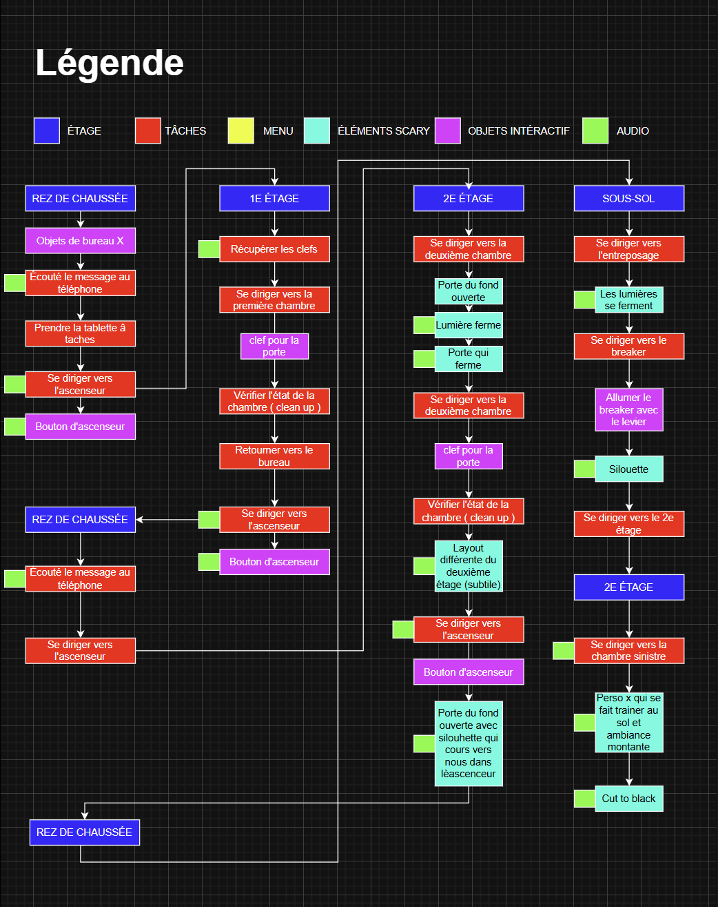

# 56 11ème Avenue
  56 11ème Avenue est une expérience en réalité virtuelle ou vous jouerez un garde de nuit qui en sait trop sur un mystérieux résident.  
  Le jeu est une expérience narrative structurée qui guidera le joueur à travers d'une une résidence sombre et calme durant un quart de nuit. Le joueur sera amené à récolter des objets clées pour accomplir des petits objectifs dans une ambiance sonore et une lumière qui rendra le jeu stressant. Le jeu sera rythmé par un élévateur qui guidera le joueur à un bureau qui servira de checkpoint pour le joueur.  Le joueur sera confronté à des segments de fouille de salle pour trouver une solution à une porte bloquée ou une panne de courant dans le building.

## Moodboard Visuel

 

## Moodboard Audio

[Radio Static - Sound Effect 0.mp3](https://github.com/user-attachments/files/26224035/Radio.Static.-.Sound.Effect.0.mp3)  
[ORBIT_FX_Phone_Call_No_Answer.wav](https://github.com/user-attachments/files/26224041/ORBIT_FX_Phone_Call_No_Answer.wav)  
[ascenseur.wav](https://github.com/user-attachments/files/26224052/ascenseur.wav)  

## Cartes du jeu

   

  

## Schéma d'interactivité
 

